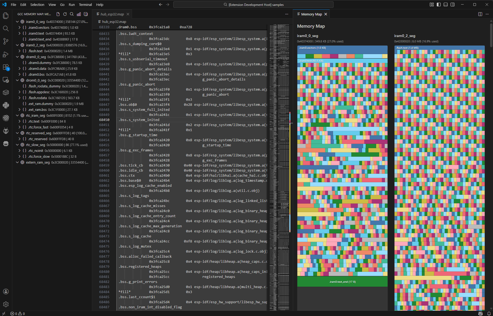

# GCC Map View

A Visual Studio Code extension that visualizes GCC linker map files (`.map`) with an interactive graphical memory map.

Works with any GCC-based toolchain — from embedded targets (STM32, ESP32) to x86/x64 Linux builds.



## Features

### Graphical Memory Map

Open a color-coded visualization of your memory regions. Each region displays proportional section blocks showing relative sizes at a glance. Click any section to drill into its symbols.

### Detail Panel

Click a section to open a detail panel showing every symbol as a labeled row with proportional height. Each row displays the symbol name, hex address, and size. Sort by address or size.

### Symbol Search

Search symbols and sections by name with the always-visible search bar. Results appear in a dropdown — click to navigate to the symbol in both the map visualization and the source text.

### Statistics Panel

Collapsible stats panel shows per-region usage with progress bars, total flash/RAM consumption, discarded section counts, and a clickable Top 10 largest symbols list.

### Go to Source

Click the arrow icon on any symbol row to jump directly to its definition in your workspace. The extension extracts source filenames from linker object references and searches your workspace automatically.

### Find in Memory Map

Right-click any symbol in a source file (C, C++, Rust, Zig, assembly) and select **Find in Memory Map** to locate it in the visualization. If the symbol was removed by `--gc-sections`, you'll be notified.

### Editor Decorations

`.map` files get color-coded background highlights on each section, with matching overview ruler markers for quick orientation.

### Auto-Open

The memory map webview opens automatically when you open a `.map` file — no extra clicks needed.

## Supported Files

| Extension | Description |
|-----------|-------------|
| `.map` | GCC linker map files (auto-detected; JS source maps are ignored) |

## Commands

| Command | Description |
|---------|-------------|
| **Show Memory Map** | Open the graphical memory map webview |
| **Refresh Memory Map** | Re-parse the active file |
| **Find in Memory Map** | Locate a symbol from source code in the memory map (right-click context menu) |

## Getting Started

1. Install the extension
2. Open a `.map` file
3. The graphical memory map opens automatically
4. Click sections to explore symbols, use the search bar to find specific items

## Development

### Prerequisites

- Node.js 20+
- VS Code 1.85+

### Build

```bash
npm install
npm run compile
```

### Test

```bash
npm test
```

### Watch

```bash
npm run watch
```

### Run

Press **F5** in VS Code to launch the Extension Development Host.

### Project Structure

```
src/
├── extension.ts              # Extension entry point
├── models/
│   └── types.ts              # Data models (MemoryRegion, Section, Symbol)
├── parsers/
│   ├── ldParser.ts           # Linker script parser
│   └── mapParser.ts          # Map file parser
├── providers/
│   └── memoryMapPanel.ts     # Webview panel (graphical map)
└── util/
    ├── format.ts             # Hex/size formatting utilities
    └── symbols.ts            # Symbol name extraction utilities
webview/
├── memoryMap.html            # Webview template
├── memoryMap.css             # Webview styles
└── memoryMap.js              # Webview rendering logic
test/
├── mapParser.test.ts         # Map parser tests
└── symbols.test.ts           # Symbol utility tests
```

## License

See [LICENSE](LICENSE) for details.
